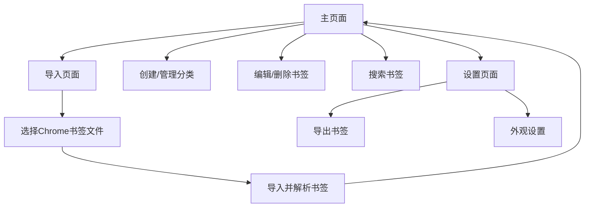

# Chrome书签整理网站需求文档

## 1. 产品概览

本网站旨在帮助用户整理和管理Chrome浏览器中的收藏网站，提供一个直观、高效的界面来查看、分类和搜索书签，解决用户书签过多难以管理的问题。

- 该产品主要面向需要管理大量书签的用户，特别是那些希望更有条理地组织个人或工作相关网站的用户。
- 产品价值在于提供比浏览器内置书签管理更强大、更灵活的功能，帮助用户提高信息管理效率。

## 2. 核心功能

### 2.1 用户角色

| 角色 | 注册方式 | 角色权限 |
|------|---------------------|------------------|
| 普通用户 | 无需注册，使用本地存储 | 可导入、管理和导出书签 |

### 2.2 功能模块

我们的Chrome书签整理网站包含以下主要页面：
1. **主页面**：书签列表展示、分类管理、搜索功能。
2. **导入页面**：Chrome书签导入功能。
3. **设置页面**：用户偏好设置。

### 2.3 页面详情

| 页面名称 | 模块名称 | 功能描述 |
|-----------|-------------|---------------------|
| 主页面 | 书签列表 | 展示所有导入的书签，支持按分类筛选，点击书签可直接打开对应网站。 |
| 主页面 | 分类管理 | 允许用户创建、编辑、删除分类，可将书签拖拽到不同分类中，支持多级分类。 |
| 主页面 | 搜索功能 | 支持按书签名称、URL和描述进行搜索，实时显示搜索结果。 |
| 主页面 | 书签操作 | 支持编辑书签名称、URL、描述，支持删除书签。 |
| 导入页面 | Chrome书签导入 | 支持从Chrome浏览器导出的HTML文件导入书签，自动解析书签结构，包括原始文件夹路径。 |
| 导入页面 | 重复检测 | 在导入过程中检测重复书签，提供合并策略选项。 |
| 导入页面 | 手动添加 | 支持手动添加新书签，包括名称、URL和分类。 |
| 设置页面 | 外观设置 | 允许用户选择不同的主题风格，调整字体大小等。 |
| 设置页面 | 导出功能 | 支持将整理后的书签导出为HTML文件，可重新导入到Chrome浏览器。 |
| 设置页面 | 数据备份 | 提供书签数据备份和恢复功能，支持操作撤销。 |

## 3. 核心流程

用户使用流程如下：
1. 用户访问网站，进入主页面
2. 用户点击导入按钮，选择Chrome导出的书签HTML文件
3. 系统解析并导入书签，在主页面展示
4. 用户可以创建分类，将书签拖拽到不同分类中
5. 用户可以编辑、删除书签，或手动添加新书签
6. 用户可以使用搜索功能快速找到特定书签
7. 用户可以在设置页面导出整理后的书签



## 4. 用户接口设计

### 4.1 设计风格

- **主色**：#3498db（蓝色）
- **辅色**：#2ecc71（绿色）
- **中性色**：#f5f5f5（背景）、#333333（文字）
- **按钮样式**：圆角矩形，有悬停效果
- **字体**：系统默认无衬线字体，标题16-20px，正文14px
- **布局样式**：响应式网格布局，卡片式设计
- **图标样式**：使用Font Awesome或Material Icons

### 4.2 页面设计概览

| 页面名称 | 模块名称 | UI元素 |
|-----------|-------------|-------------|
| 主页面 | 顶部导航栏 | 网站标题、导入按钮、设置按钮，背景色#3498db，文字白色 |
| 主页面 | 左侧分类栏 | 分类列表，当前选中分类高亮显示，支持折叠/展开 |
| 主页面 | 右侧书签区域 | 书签卡片网格布局，每个卡片显示书签名称、URL和分类，支持拖拽操作 |
| 主页面 | 搜索栏 | 位于顶部导航栏下方，输入框+搜索按钮，支持实时搜索 |
| 导入页面 | 导入区域 | 文件选择按钮、导入按钮，显示导入进度和结果 |
| 导入页面 | 手动添加表单 | 输入框：名称、URL、分类选择器，提交按钮 |
| 设置页面 | 外观设置区域 | 主题选择下拉框、字体大小调整滑块 |
| 设置页面 | 导出区域 | 导出按钮，显示导出状态 |

### 4.3 自适应

- 设计以桌面端为主，同时支持平板和移动端
- 在小屏幕设备上，左侧分类栏将变为顶部下拉菜单
- 书签卡片布局会根据屏幕宽度自动调整列数
- 触摸设备支持手势操作，如滑动删除、长按编辑等

### 4.4 用户体验

#### 空状态设计
- **无书签状态**：当用户首次访问或清空所有书签时，显示友好的空状态提示，引导用户导入Chrome书签
- **无搜索结果状态**：当搜索没有匹配结果时，显示相关提示信息，建议用户尝试其他关键词
- **无分类状态**：当没有创建分类时，显示默认分类，并引导用户创建新分类

#### 加载态设计
- **导入加载**：在导入大量书签时，显示进度条和加载动画，提供实时导入状态
- **搜索加载**：在搜索过程中，显示加载指示器，提升用户感知
- **数据保存**：在保存书签或分类时，显示短暂的保存中提示

#### 操作反馈
- **成功反馈**：操作成功后显示绿色的成功提示，如"书签添加成功"、"分类创建成功"
- **错误反馈**：操作失败时显示红色的错误提示，如"导入失败"、"分类名称已存在"
- **确认提示**：对于删除等危险操作，显示确认对话框，防止用户误操作
- **撤销操作**：提供操作撤销功能，允许用户在一定时间内撤销最近的操作

### 4.5 数据安全

#### 备份提醒
- 定期提醒用户备份书签数据，可导出为HTML文件
- 在执行批量操作前，自动创建备份点
- 支持将备份文件下载到本地存储

#### 操作撤销机制
- 实现操作历史记录，支持撤销最近的操作
- 提供恢复到之前备份点的功能
- 在删除书签或分类时，将其移至回收站，支持恢复

## 5. 技术架构

### 5.1 技术栈

- **前端**：HTML5、CSS3、JavaScript (ES6+)
- **CSS框架**：Tailwind CSS
- **图标库**：Font Awesome
- **数据存储**：localStorage（本地存储）
- **文件处理**：FileReader API（解析HTML文件）
- **拖拽功能**：HTML5 Drag and Drop API

### 5.2 数据结构

```javascript
// 书签数据结构
const bookmark = {
  id: "unique-id",
  title: "网站标题",
  url: "https://example.com",
  description: "网站描述",
  category: "分类名称",
  favicon: "https://example.com/favicon.ico", // 网站图标
  originalPath: "书签栏/工作/工具", // 原始文件夹路径
  createdAt: "2023-06-01T12:00:00Z",
  updatedAt: "2023-06-01T12:00:00Z"
};

// 分类数据结构
const category = {
  id: "category-id",
  name: "分类名称",
  color: "#3498db",
  parentId: "parent-category-id", // 父分类ID，支持多级分类
  createdAt: "2023-06-01T12:00:00Z"
};
```

### 5.3 本地存储

- 使用localStorage存储书签和分类数据
- 数据以JSON格式存储
- 每次数据变更时自动保存到localStorage
- 提供导入/导出功能，支持与Chrome浏览器的书签同步

## 6. 实现计划

1. **搭建基础项目结构**：创建HTML、CSS和JavaScript文件
2. **实现页面布局**：使用Tailwind CSS构建响应式布局
3. **实现书签导入功能**：解析Chrome导出的HTML文件
4. **实现书签管理功能**：添加、编辑、删除书签
5. **实现分类管理功能**：创建、编辑、删除分类
6. **实现搜索功能**：按名称、URL和描述搜索书签
7. **实现导出功能**：将书签导出为HTML文件
8. **添加响应式设计**：适配不同屏幕尺寸
9. **测试和优化**：确保功能正常，性能良好

## 7. 测试策略

- **功能测试**：测试所有核心功能是否正常工作
- **兼容性测试**：测试在不同浏览器中的表现
- **响应式测试**：测试在不同屏幕尺寸下的显示效果
- **性能测试**：测试导入大量书签时的性能
- **用户体验测试**：评估界面易用性和操作流畅度

## 8. 未来扩展

- **云存储**：支持将书签同步到云端
- **多浏览器支持**：支持从Firefox、Safari等其他浏览器导入书签
- **标签系统**：为书签添加标签，实现更灵活的分类
- **批量操作**：支持批量编辑、删除书签
- **备份与恢复**：自动备份书签数据，支持恢复到之前的版本
- **共享功能**：支持与他人共享书签或分类